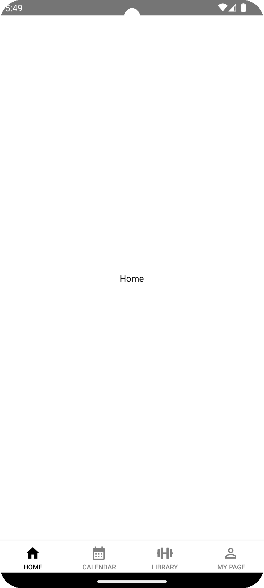
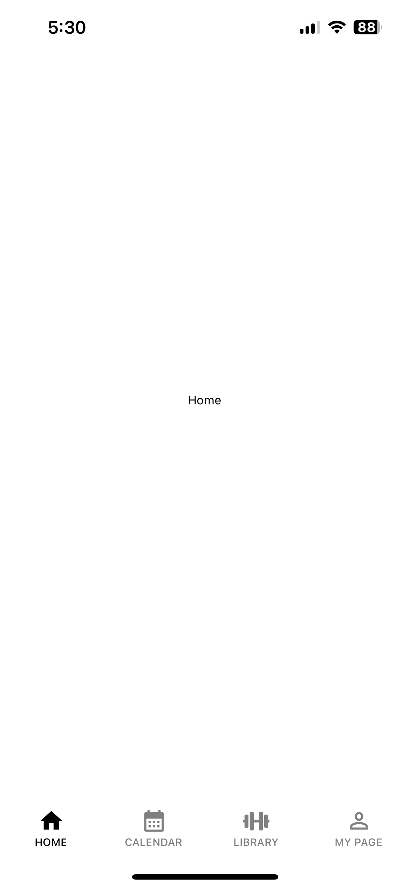
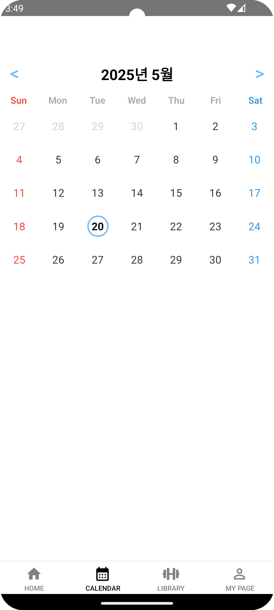
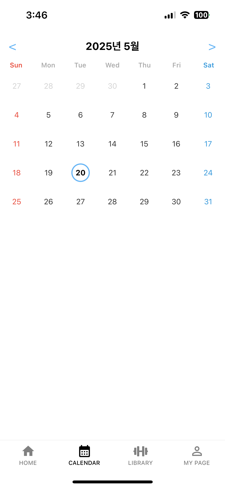
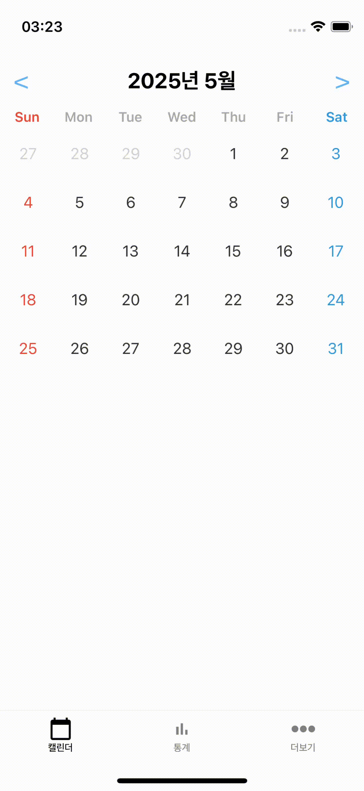

# [BurnFit] Front-end 과제 정종원

## 1. 구현 내용

### Level1,2의 내용은 이어지는 내용이라 level1 프로젝트에 같이 구현했습니다.

### level1 스크린샷

### level2 스크린샷

### Level3 제스처를 추가하였으나, 좌우로 스와이프할 시 이전/다음 달 또는 이전/다음 주의 내용이 자연스럽게 보이는 것은 구현하지 못했습니다.

### level3 시연 영상
